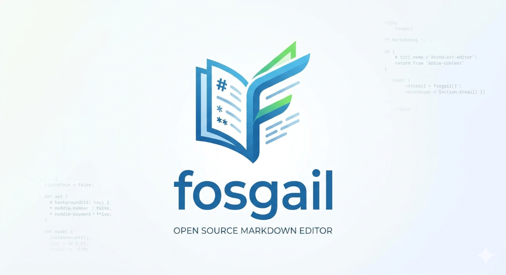

> A lightweight, offline Markdown viewer and editor built with React + Tauri. A premium, bloat-free alternative to opening an IDE just to read a `.md` file.

[](https://github.com/IanMcNelly/markdown-viewer/actions/workflows/ci.yml)
[](#testing)
[](LICENSE)

---

## Features

- **Live Split Preview** — edit on the left, see the rendered output on the right in real time
- **Synchronized Scrolling** — the preview tracks your cursor position automatically
- **Command Palette** — `Cmd+K` / `Ctrl+K` spotlight search across files and app commands
- **Document Outline** — floating heading navigator, Typora-style (`Cmd+I`)
- **Mermaid Diagrams** — lazy-loaded, zero cost unless your document uses them
- **Export to PDF** — native OS print dialog (`Cmd+P`)
- **Workspace Support** — open an entire folder of `.md` files
- **Custom CSS Themes** — write your own markdown stylesheet live
- **Zen Mode** — distraction-free fullscreen writing
- **Offline** — zero network dependency, all data stays on disk

---

## Tech Stack

| Layer | Technology |
|-------|-----------|
| Frontend | React 19, Vite, Tailwind CSS 4 |
| State | Zustand 5 |
| Markdown | react-markdown, remark-gfm, PrismJS |
| Diagrams | Mermaid (lazy-loaded) |
| Desktop | Tauri v2 (Rust) |
| Icons | Lucide React |
| Tests | Vitest, React Testing Library |

---

## Getting Started

### Prerequisites

- [Node.js 20+](https://nodejs.org/)
- [Rust stable](https://rustup.rs/) (for desktop builds only)

### Web Dev Mode (no Rust needed)

```bash
git clone https://github.com/IanMcNelly/markdown-viewer
cd markdown-viewer
npm install
npm run dev        # → http://localhost:3000
```

### Native Desktop Dev Mode

```bash
npm install
npm run desktop    # runs `tauri dev`
```

---

## Testing

```bash
npm test              # run all 106 tests once
npm run test:watch    # interactive watch mode
npm run test:coverage # generate coverage report (HTML + lcov)
```

The test suite covers:
- **31 utility unit tests** — `normalizePath`, `slugify`, `simpleHash`, `calculateWordCharCount`, `parseHeadings`
- **21 Zustand store tests** — all state actions, recently-viewed tracking, feature flags
- **14 OutlinePanel tests** — heading extraction, empty state, theme classes, scroll
- **18 MarkdownOutput tests** — rendering, heading IDs (regression), code blocks, task lists
- **22 CommandPalette tests** — file search, command mode, keyboard navigation (↑↓↵Esc)

---

## CI/CD

Two GitHub Actions workflows are included:

### `ci.yml` — runs on every push and PR

| Job | Trigger | What it does |
|-----|---------|-------------|
| Lint & Test | every push/PR | TypeScript check + 106 tests |
| Frontend Build | after tests pass | `vite build` |
| Tauri Smoke Build | pushes to `main` only | cross-platform Tauri build on Win/Mac/Linux |

### `release.yml` — triggered by a git tag

```bash
git tag v1.2.3
git push origin v1.2.3
```

The workflow automatically:
1. **Patches `package.json`, `tauri.conf.json`, and `Cargo.toml`** with the version from the tag — you never need to update version strings manually
2. Runs the full test suite as a gate
3. Builds native installers for all 3 platforms in parallel
4. Publishes a **GitHub Release** with download links

Pre-release tags are supported too (`v1.0.0-beta.1`, `v2.0.0-rc.1`).

#### Optional: Code Signing

Set these repository secrets to enable signed builds:

| Secret | Description |
|--------|-------------|
| `TAURI_SIGNING_PRIVATE_KEY` | Your Tauri signing private key |
| `TAURI_SIGNING_PRIVATE_KEY_PASSWORD` | The key password |

---

## Keyboard Shortcuts

| Action | macOS | Windows/Linux |
|--------|-------|---------------|
| Command Palette | `⌘K` | `Ctrl+K` |
| File Switcher | `⌘T` | `Ctrl+T` |
| Save to Disk | `⌘S` | `Ctrl+S` |
| Open Workspace | `⌘O` | `Ctrl+O` |
| New Draft | `⌘N` | `Ctrl+N` |
| Toggle Outline | `⌘I` | `Ctrl+I` |
| Toggle Sidebar | `⌘B` | `Ctrl+B` |
| Cycle View Mode | `⌘M` | `Ctrl+M` |
| Zen Mode / Exit | `⌘Esc` | `Ctrl+Esc` |

---

## License

MIT — see [LICENSE](LICENSE).
